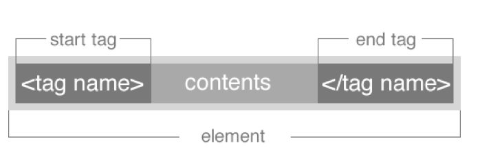

# Introduction to Front End Web Development

## Overview of Front-End Web Development
- Front-end web development consists of writing code in HTML, CSS, and JavaScript.
- HTML is the structure of the page. It is the scaffold that adds various layout elements to your website.
- CSS is a set of style properties that give your page its look and feel. It gives HTML style.
- JavaScript adds interactivity to your pages and makes them dynamic. Think of dropdown menus, sliding and fading boxes, dynamic content reloading, etc.

## Overview of Back-End Web Development
- The back-end is a set of tools that enable the greater functionality of the website.
- Usually included in the back-end logic is database interaction.
- Here are a few examples of back-end languages:
	- Ruby
	- PHP
	- Python
	- C++

## How to Be a Professional Developer
- [GitHub](https://github.com/) is a tool that allows you to create versions of your project. It is highly used in the industry to save changes and also enable collaboration.
- Atom and Sublime Text are fancy text editors that allow you to write code in many different languages. They help you with syntax highlighting, code completion, error checking, and more.

## Draw It Out
- At the end of the day, the internet is about humans and the people who use these systems, so let's start there when we think of how it all works.
- Get in to groups and think about the web. What happens when our humans fire up Chrome or Safari and type in a URL?
- Draw with as much detail as you can what you think happens between that act and finally getting the page back in the browser.

## HTML Syntax
- Tags are elements on the page. Each have their own name and are enclosed by the caret syntax.



- Most tags have attributes that can add additional information to the element.


## Common HTML Tags

##### Div:
- Divs are like empty rectangles.
- They help organize content on the page.

```
<div class="margin-top-20 logo">
	My Text Inside
</div>
```

##### Input:
- Inputs allow users to enter data to be saved to a database.
- They come in different forms to facilitate the specific data entry type.

```
<input type="text" class="form-control" />
```

##### Select list:
- Select lists allow users to select options from a dropdown menu.

```
<select>
	<option value="USA">United States</option>
</select>
```

##### Button:
- Buttons are HTML elements that give users the ability to submit the data entered as well as transition to new pages.

```
<button>My Button</button>
```

##### Linking CSS with HTML
- CSS creates the look and feel of the website.
- In order to run external CSS you need to link it to the HTML. This usually goes in the `head` tag:

```
<link rel="stylesheet" href="css/mystyle.css" />
```

##### Linking JS with HTML
- JavaScript enables interaction with the page.
- In order to run external JS you need to link it to the HTML. This usually goes before the closing `body` tag:

```
<script src="js/script.js"></script>
```

## HTML Markup Lab
- Open the `html_form` folder and open `index.html`.
- For each comment denoted by `<!-- -->` replace the comment text with the correct HTML as per the instruction to create the form.
- Alter the CSS file to use a Google Fonts font. You will need to use the `font-family` CSS property.
- Bonus: Use CSS to change the background color of the page. Experiment with using images as backgrounds as well.
- Double Bonus: Review the CSS `transition` property documentation and try to create a small animation anywhere on the form. An example may be to highlight a border around a form field when it is clicked.

## More Content Tags

##### Heading Elements

```
<h1>Largest Heading</h1>
<h2>...</h2>
<h3>...</h3>
<h4>...</h4>
<h5>...</h5>
<h6>Smallest Heading</h6>
```

##### Text Elements

```
<p>This is a Paragraph</p>

<strong>This is some Bold Text</strong>

<small>This is some Small Text</small>
```

##### Lists

```
<ul>
	<li>First List Item</li>
	<li>Second List Item</li>
	<li>Third List Item</li>
	<li>Fourth List Item</li>
</ul>
```

```
<ol>
	<li>First List Item</li>
	<li>Second List Item</li>
	<li>Third List Item</li>
	<li>Fourth List Item</li>
</ol>
```

##### Links

```
<a href="mylink.html">My Link</a>
```

## HTML Structure

```
<!DOCTYPE html>
<html>
<head>
	<title>Website Title</title>
</head>
<body>
	Content Goes Here
</body>
</html>
```

- The doctype tells the browser that the document is an HTML document.
- The `head` tag is where certain tags go that send information to the browser. The `title` tag is an example of this.
- The elements that users will see should go in the `body` tag.

## General Assembly Press Release Code-Along

##### Consider the following text:

> For Immediate Release General Assembly, which started in New York as a startup incubator, now offers classes and workshops in technology, design, and entrepreneurship, with campuses around the world in: Berlin Boston Hong Kong London Los Angeles New York City San Francisco Sydney Washington D.C For more information, visit General Assembly's website.

- How could we arrange this text in a layout that makes sense?
- Which HTML tags may we want to use here?

## Cookie Recipe Lab
- For this exercise we will be coding a simple cookie recipe.
- In order to complete the assignment you will need to research the `` tag.
